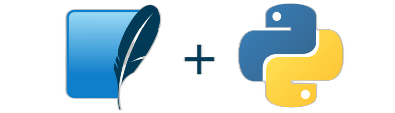

# CURSO DE PYTHON COM SQLITE
👨‍⚖️PYTHON É UMA LINGUAGEM DE PROGRAMAÇÃO. SQLITE É UM SISTEMA DE GERENCIAMENTO DE BANCO DE DADOS RELACIONAL; ELE UTILIZA UMA LINGUAGEM SQL PARA REALIZAR OPERAÇÕES DE CONSULTA E MANIPULAÇÃO DE DADOS.

  

## CONCEITO:
### PYTHON:
**Python** é uma linguagem de programação de alto nível, interpretada e de propósito geral. Foi criada por Guido van Rossum e lançada pela primeira vez em 1991. Python é conhecida por sua sintaxe clara e concisa, o que a torna uma das linguagens preferidas tanto para iniciantes quanto para programadores experientes. Aqui estão alguns pontos-chave sobre Python:

- **Sintaxe Simples e Legível**: A sintaxe de Python é projetada para ser intuitiva e fácil de ler, o que facilita o desenvolvimento e a manutenção do código.
- **Linguagem Interpretada**: Python é executada linha por linha, o que facilita a depuração e a interação imediata com o código.
- **Versatilidade**: Pode ser usada para desenvolvimento web, automação, análise de dados, inteligência artificial, e muito mais.
- **Bibliotecas e Frameworks**: Possui uma vasta coleção de bibliotecas e frameworks que ajudam a acelerar o desenvolvimento de aplicações complexas.

### SQLITE:
**SQLite** é um sistema de gerenciamento de banco de dados relacional (RDBMS) leve e autônomo. Foi projetado para ser um banco de dados embutido, significando que ele não requer um servidor separado para operar. Aqui estão algumas características importantes do SQLite:

- **Autônomo e Embutido**: SQLite é uma biblioteca que se integra diretamente a uma aplicação, eliminando a necessidade de configuração de servidor.
- **Zero Configuração**: Não requer instalação, configuração de servidor ou gerenciamento de usuários, tornando-o fácil de usar e implantar.
- **Armazenamento em Arquivo Único**: Todos os dados do banco de dados são armazenados em um único arquivo de disco, facilitando a portabilidade e backup.
- **Leve e Rápido**: Projetado para ser leve e eficiente, adequado para aplicações com requisitos de recursos limitados, como dispositivos móveis e sistemas embarcados.

### PYTHON COM SQLITE:
Combinar Python com SQLite é uma prática comum em desenvolvimento de aplicações devido à facilidade de uso de ambos. Python fornece bibliotecas integradas, como `sqlite3`, que permitem manipular bancos de dados SQLite de forma direta e eficiente. Essa combinação é ideal para:

- **Desenvolvimento Rápido**: Permite criar protótipos e aplicações completas de forma rápida e eficiente.
- **Aplicações Locais e Portáteis**: Ideal para aplicações que precisam de um banco de dados embutido e não necessitam de um servidor dedicado.
- **Gerenciamento Simples de Dados**: Facilita a manipulação e gerenciamento de dados em pequenos a médios projetos sem a complexidade de sistemas de banco de dados maiores.

## SUA HISTÓRIA:
### PYTHON:
**Python** foi criado por Guido van Rossum e lançado pela primeira vez em 1991. A linguagem foi desenvolvida como sucessora da linguagem ABC, com a intenção de corrigir suas falhas enquanto mantinha suas vantagens. Aqui está um breve resumo da história de Python:

- **1980s**: Guido van Rossum começou a trabalhar no projeto Python como um hobby no final dos anos 1980. A intenção era criar uma linguagem de programação que fosse fácil de ler e escrever.
- **1991**: A primeira versão pública, Python 0.9.0, foi lançada em fevereiro de 1991. Esta versão já incluía muitas das características que ainda definem Python hoje, como exceções, funções, e os tipos de dados principais como listas e dicionários.
- **2000**: Python 2.0 foi lançado, introduzindo novas funcionalidades, como a coleta de lixo cíclica e suporte a Unicode. Este também foi o ano em que a Python Software Foundation (PSF) foi criada, uma organização sem fins lucrativos dedicada ao desenvolvimento da linguagem.
- **2008**: Python 3.0 foi lançado, trazendo mudanças significativas na linguagem com a intenção de corrigir defeitos fundamentais. Esta versão não era totalmente compatível com versões anteriores, o que levou a um longo período de transição.
- **Atualidade**: Python continuou a evoluir, com lançamentos regulares e melhorias contínuas. A linguagem se tornou uma das mais populares no mundo, amplamente usada em ciência de dados, desenvolvimento web, automação, inteligência artificial, e muitas outras áreas.

### SQLITE:
**SQLite** foi criado por D. Richard Hipp em 2000. Ele desenvolveu o SQLite com o objetivo de proporcionar um banco de dados embutido que fosse simples de usar, configurável, e adequado para uma ampla gama de aplicações. Aqui está um breve resumo da história do SQLite:

- **2000**: D. Richard Hipp lançou a primeira versão do SQLite, inspirado pela necessidade de um banco de dados embutido e eficiente durante seu trabalho em um projeto de software.
- **2003**: SQLite 2.0 foi lançado, introduzindo suporte para transações ACID (Atomicidade, Consistência, Isolamento, Durabilidade), que são essenciais para a integridade dos dados.
- **2004**: SQLite 3.0 foi lançado, trazendo melhorias significativas, incluindo um novo analisador SQL e suporte para uma gama mais ampla de tipos de dados.
- **2007**: SQLite se tornou um projeto de domínio público, permitindo seu uso gratuito e ilimitado em qualquer aplicação. Isso contribuiu para sua ampla adoção.
- **Atualidade**: SQLite continua a ser mantido e melhorado ativamente, sendo amplamente utilizado em aplicativos móveis, navegadores web, sistemas operacionais, e muito mais. Sua simplicidade e eficiência o tornaram um dos sistemas de gerenciamento de banco de dados mais implantados no mundo.

### PYTHON COM SQLITE:
A combinação de Python e SQLite representa a união de duas ferramentas poderosas, cada uma com uma história de evolução constante e adaptação às necessidades dos desenvolvedores. Python, com sua sintaxe clara e comunidade ativa, e SQLite, com sua simplicidade e eficiência, juntas permitem a criação de aplicações robustas, portáteis e fáceis de manter.

## CARACTERISTICAS:
### POSITIVAS:
1. **Simplicidade e Facilidade de Uso**:
   - **Python**: A sintaxe de Python é clara e intuitiva, facilitando a aprendizagem e a escrita de código.
   - **SQLite**: SQLite não requer instalação de servidor, configuração de usuários ou administração complexa. É um banco de dados leve e auto-suficiente.

2. **Portabilidade**:
   - O banco de dados SQLite é armazenado em um único arquivo, o que facilita a transferência entre diferentes sistemas e ambientes. Isso é útil para desenvolvimento local, testes e distribuição de aplicativos.

3. **Rápida Configuração**:
   - Integrar SQLite com Python é simples e rápido. A biblioteca `sqlite3` é parte da biblioteca padrão do Python, então não há necessidade de instalar pacotes adicionais para começar a usar.

4. **Desempenho Satisfatório para Aplicações Pequenas a Médias**:
   - SQLite oferece bom desempenho para a maioria das aplicações de pequeno a médio porte. É adequado para desenvolvimento web, aplicativos móveis, scripts de automação e prototipagem.

5. **Transações ACID**:
   - SQLite suporta transações ACID (Atomicidade, Consistência, Isolamento, Durabilidade), garantindo a integridade dos dados durante operações complexas.

6. **Biblioteca Padrão do Python**:
   - O módulo `sqlite3` é incluído na biblioteca padrão do Python, o que significa que não é necessário instalar pacotes adicionais para usar SQLite com Python.

### NEGATIVAS:
1. **Limitações de Concorrência**:
   - SQLite usa bloqueio de arquivo para gerenciar a concorrência, o que pode ser uma limitação em aplicativos com muitos acessos simultâneos. Não é ideal para sistemas de alto tráfego.

2. **Capacidade de Escalabilidade**:
   - SQLite é projetado para ser leve e eficiente, mas não é adequado para aplicações de grande escala ou com requisitos de alta disponibilidade e redundância, como grandes sistemas de banco de dados empresariais.

3. **Funcionalidades Limitadas em Relação a Outros SGBDs**:
   - SQLite não possui algumas funcionalidades avançadas encontradas em outros sistemas de gerenciamento de banco de dados (SGBDs) como PostgreSQL ou MySQL, tais como armazenamento de procedimentos, triggers avançados e suporte a várias conexões simultâneas.

4. **Suporte a Tipos de Dados Limitado**:
   - SQLite tem um sistema de tipos de dados mais flexível, mas menos rigoroso em comparação com outros SGBDs, o que pode levar a inconsistências se não for gerenciado corretamente.

5. **Falta de Suporte a Usuários e Senhas**:
   - Diferentemente de outros SGBDs, SQLite não possui um sistema interno de gerenciamento de usuários e senhas, o que pode ser uma desvantagem em termos de segurança para certos tipos de aplicações.

6. **Falta de Funcionalidades de Administração**:
   - SQLite não oferece muitas das ferramentas de administração e monitoramento que são padrão em outros SGBDs, o que pode tornar a gestão e a manutenção mais difíceis em ambientes de produção.

## SUBSIDIOS:
- [CURSO CRIADO PELO "PROFESSOR NETO PASCHOAL"](https://youtube.com/playlist?list=PLwsAoT89dh3pnuT7dGaG4vdxCpo5tJI8S&si=3LF2PtmKQ8Gj7oyK)
- [CURSO FEITO PELO VILHALVA](https://github.com/VILHALVA)
- [LINGUAGEM DE PROGRAMAÇÃO](https://github.com/VILHALVA/CURSO-DE-PYTHON)
- [VEJA O CURSO DE SQLITE](https://github.com/VILHALVA/CURSO-DE-SQLITE)
- [VEJA A SINTAXE](./SINTAXE.md)
- [VEJA OS PROJETOS](https://github.com/VILHALVA?tab=repositories&q=topic:PYTHON+topic:SQLITE)